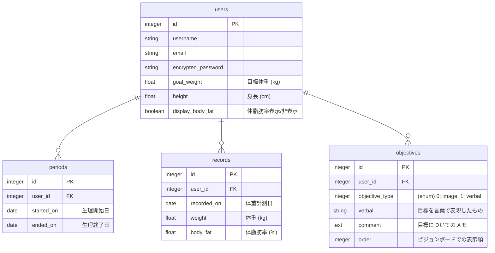

# README

This README would normally document whatever steps are necessary to get the
application up and running.

Things you may want to cover:

* Ruby version

* System dependencies

* Configuration

* Database creation

* Database initialization

* How to run the test suite

* Services (job queues, cache servers, search engines, etc.)

* Deployment instructions

* ...

### 🕸 エンドポイント設計

[lean_up エンドポイント設計へのリンク](https://docs.google.com/spreadsheets/d/1Z1wLgV0w5Yahmgej5PTBkupyOgN5MLF3IbYC9ccy6dQ/edit?usp=sharing)

### 🧜🏽‍♀ DB設計

### 🔱 DB設計の補足
#### periods 生理周期テーブル
- 生理周期を登録したい場合に利用
- 開始（予定）日と終了（予定）日を生理周期登録画面にて登録
- 体重記録時に、生理開始1週間前〜生理終了日の期間内ならそれに合わせたメッセージが体重記録後に表示される

#### objectives 目標テーブル
- 目標を登録すると、ビジョンボード画面にてフィード形式で登録した目標の画像or言葉たちが表示される
- 目標登録画面にて、登録する目標のタイプを"画像"(image)か"言葉"(verbal)のどちらか選び、追記したいことがあればメモに記し目標を登録する
- 目標編集画面にて、ビジョンボードに表示する並び順を変更できる
