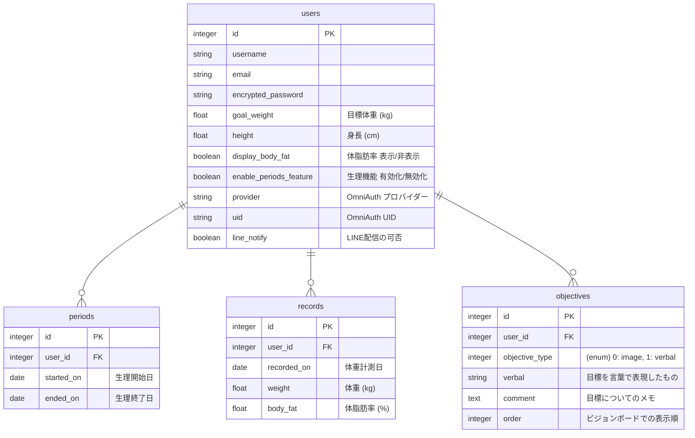

# 🌱 lean up
lean up の目的は、ダイエットを楽しく継続するサポートをすること。<br>
ダイエットが続かない要因は、大きく２つ。<br>
ダイエット自体がストレスになるのと、多様な刺激の中で生活改善のモチベーションを保つのが難しいから。 <br>
この２つの問題を解決するために、lean upを作っています。

## 📱 アプリURL
https://lean-up.life
<br>

## 概要・背景

### 💭 ダイエットの問題意識
「ダイエット = 体重を落とす」ではない。<br>
本来のダイエットとは、健康的な食習慣を定着させて、健やかに生きること。
体型や美的感覚に関係なく、実はすべての人にとって大事なもの。<br>
しかし現代、健康的な食生活を維持するのはかつてないほど難しくなっている。
多忙、ストレス、錯綜するダイエット情報、魅力的なジャンクフード、健康食品に擬態した数多の加工食品。<br>
そのような中で、ダイエットをサポートするアプリは大きな助けになる。<br>
体重管理、食事管理、運動管理ができる素晴らしいアプリは既にたくさんあるが、 継続することをサポートするアプリも必要では、と思った。

<br>

### 🧍 想定するユーザー
- 健康的な食習慣や運動習慣を身につけたいけど、途中でつらくなってやめてしまう
- 美味しそうな食べ物を目にすると、身体に負担がかかると分かっていても食べてしまう
- 期待していたほどのダイエット成果を感じられないと、どうでもよくなってしまう
- ダイエットを頑張っていても、ストレスや疲れが溜まるとつい食に走り、ダイエットをやめてしまう

<br>

### 🤷 ユーザーが持つ課題
- しばらく続けていると、なんのために頑張っているかわからなくなる
- 体重を記録しなければと思うが、日々の数値の上下に一喜一憂して振り回される

<br>

### 🔑 ダイエット継続サポートのアプローチ
- **目標を視覚化し、毎朝リマインド**
  - 自分が何を目的にダイエットをしているのか、ダイエットの目標を画像や言葉で保存していつでも一覧で確認できる
    - 目標を視覚化したものは"ビジョンボード"と呼ばれ、ビジョンボードを日々目にすることは目標達成に有用であると言われている
  - 毎朝LINEにてビジョンボードから登録した画像や文言がひとつ配信され、１日の中で健康的な意思決定ができるよう背中を押す
- **体重記録のストレスを最小化**
    - 体重記録を2週間の移動平均値で表示し、日々の上下の振れ幅を最小化
    - 体重が増えていても、記録後のフラッシュメッセージで気持ちを落ち着かせるような言葉を表示
    - 生理期間における体重の大幅な増加時は、よりストレスを受けやすいので生理期間特有のメッセージを用意
<br>

## ⚙️ 技術面

### 🔗 エンドポイント設計

[lean_up エンドポイント設計へのリンク](https://docs.google.com/spreadsheets/d/1Z1wLgV0w5Yahmgej5PTBkupyOgN5MLF3IbYC9ccy6dQ/edit?usp=sharing)

### 🧜🏽‍♀ DB設計



### 🔱 DB設計の補足
#### periods 生理周期テーブル
- 生理周期を登録したい場合に利用
- 開始（予定）日と終了（予定）日を生理周期登録画面にて登録
- 体重記録時に、生理開始1週間前〜生理終了日の期間内ならそれに合わせたメッセージが体重記録後に表示される

#### objectives 目標テーブル
- 目標を登録すると、ビジョンボード画面にてフィード形式で登録した目標の画像or言葉が表示される
- 目標登録画面にて、登録する目標のタイプを"画像"(image)か"言葉"(verbal)のどちらか選び、追記したいことがあればメモに記し目標を登録する
- 目標編集画面にて、ビジョンボードに表示する並び順を変更できる
<br>

### 🦾 使用技術
#### バックエンド
- Ruby 3.4.3
- Rails 8.0.2.1

#### フロントエンド
- HTML
- SCSS
- JavaScript
- Semantic UI

#### データベース
- PostgreSQL

#### アプリケーションサーバ
- Puma

#### コンテナ管理
- Docker

#### CI/CD
- GitHub Actions

#### ユーザー認証
- Devise
- Omniauth-oauth2 

#### 画像アップロード
- ActiveStorage

#### 画像ストレージ
- Amazon S3

#### バックグラウンドジョブ
- Solid Queue

#### コード解析
- RuboCop
- Erblint

#### テスト
- RSpec

#### デプロイ
- AWS (CloudFormation)
  - インフラ構成図（leanup/deployディレクトリ下にテンプレートファイルあり）<br>
    
<br>

### 🔧 環境構築
- リポジトリのクローン
```sh
$ gh repo clone sarii0213/lean_up
```

- Dockerコンテナ起動
```sh
$ docker-compose up
```

- Gemインストール
```sh
$ docker-compose run --rm web bundle
```

- データベース作成
```sh
$ docker-compose run --rm web bin/rails db:create
```

- テーブル作成
```sh
$ docker-compose run --rm web bin/rails db:migrate
```

- シードデータを反映
```sh
$ docker-compose run --rm web bin/rails db:seed_fu
```

- テストの実行
```sh
$ docker-compose run --rm web bundle exec rspec
```
